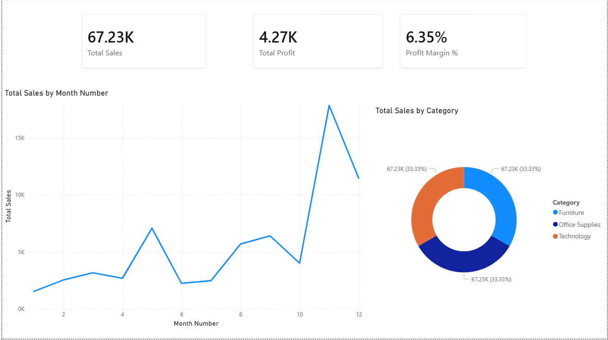
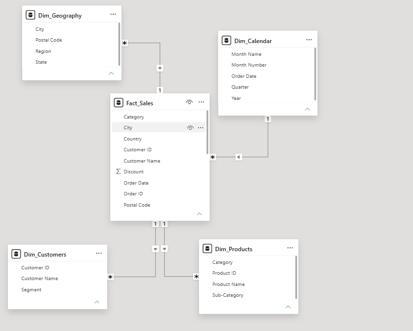

# Retail Sales & Profit Analytics Dashboard

## 📊 Project Overview
This project focuses on building an interactive end-to-end Power BI dashboard to analyze retail business health. The dashboard provides executive-level insights into overall sales performance, profit margins, and product categories over time, empowering stakeholders to make data-driven decisions.

## 🛠️ Key Features & Architecture
* *Star Schema Architecture:* Designed a robust data model by separating data into optimized fact and dimension tables linked via 1-to-Many ($1 \rightarrow *$) relationships.
* *Dynamic DAX Measures:* Developed explicit business logic metrics including Total Sales, Total Profit, and a formatted Profit Margin %.
* *Time-Series Analysis:* Built a chronological monthly trend line to pinpoint seasonal business spikes and drops.
* *Product Segmentations:* Integrated visual breakdowns for quick category performance analysis.

## 🖥️ Dashboard Preview

## 🗃️ Data Model View (Star Schema)

## 💡 Key Business Insights
1. *Healthy Margins:* The business operates at an overall healthy *6.35% Profit Margin*, driven heavily by high-performing product segments.
2. *Category Balance:* Sales are evenly distributed at *33.33%* across all three major product categories (Furniture, Office Supplies, and Technology), demonstrating balanced inventory performance.
3. *Seasonal Trends:* The monthly trend line highlights distinct operational cycles, showing low performance during the middle quarters followed by aggressive sales growth toward the end of the fiscal period
